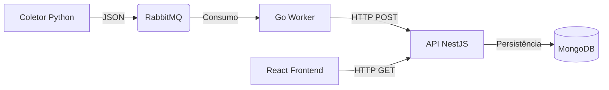

# 🌍 GDASH Climate Monitor

> Sistema distribuído de monitoramento climático em tempo real com arquitetura de microsserviços.  

Este projeto foi desenvolvido como parte do Desafio Técnico GDASH. Ele integra coleta de dados, processamento de filas de alta performance, API RESTful e uma interface reativa moderna.  

---

## Preview do Dashboard

<p align="center">
  
</p>


### Demonstração

 Assista ao vídeo explicativo no YouTube  

<a href="https://youtu.be/jp26NIm6Bbk" target="_blank">
  
</a>

---

## Arquitetura do Sistema


- Python (Producer): coleta dados da API Open-Meteo a cada 30m (Temperatura, Vento, Umidade, Máx/Min).  
- RabbitMQ (Broker): garante a fila e integridade das mensagens.  
- Go (Consumer): worker de alta performance que processa a fila e entrega para a API.  
- NestJS (Backend): gerencia regras de negócio, autenticação, insights de IA e persistência.  
- MongoDB (Banco): armazenamento NoSQL escalável.  
- React (Frontend): dashboard interativo com Shadcn/UI, Recharts e lógica visual adaptativa.  

---

### Tecnologias Utilizadas

| Camada       | Tecnologia        | Destaques |
|--------------|------------------|-----------|
| Infra    | Docker Compose   | Orquestração completa de 6 serviços |
| Coleta   | Python 3.12      | Pika (AMQP), Requests, tratamento de erros |
| Fila     | RabbitMQ         | Mensageria robusta para desacoplamento |
| Worker   | Go (Golang)      | Processamento concorrente e eficiente |
| API      | NestJS           | TypeScript, Mongoose, seeding automático |
| Banco    | MongoDB          | Armazenamento NoSQL escalável |
| Front    | React + Vite     | TailwindCSS, Shadcn/UI, Lucide Icons |

---

### Diferenciais e Features

- 📊 Insights Inteligentes: análise de histórico para calcular tendências (Alta/Queda) e dicas de saúde.  
- 🎨 UI Adaptativa: dashboard muda cores e ícones (Sol, Chuva, Noite) automaticamente.  
- 🧑‍🎤 Avatar Dinâmico: personagem interativo reage ao clima (roupa de frio, óculos de sol, pijama à noite).  
- 🌍 Modo Pesquisa: consulta clima de qualquer cidade em tempo real sem afetar histórico local.  
- 📈 Gráficos e Relatórios: filtros de tempo e exportação para CSV.  
- 🔐 Segurança: login com proteção de rotas e persistência de sessão.  

---

### Como Rodar o Projeto

O projeto é 100% Dockerizado — não é necessário instalar Python, Go ou Node localmente.  

Pré-requisitos
- Docker  
- Docker Compose  

#### Passo a Passo

## Como rodar o projeto

```bash
git clone https://github.com/Tiagliveira/desafio-gdash.git
cd desafio-gdash
docker-compose up --build
```

#### Aguarde alguns minutos na primeira vez para download das imagens e compilação.  

---

## Acesse a Aplicação


- Frontend: ```http://localhost:5173```  
- API: ```http://localhost:3000```  

Credenciais de Acesso (Seeding Automático)
- E-mail: ```admin@gdash.com```  
- Senha: ```123456```  

---

## Testando a Arquitetura

Você pode acompanhar os logs no terminal:  

- Python: verá [ENVIADO] a cada ciclo.  
- Go: verá Processando mensagem... e Sucesso! 201 Created.  
- RabbitMQ: monitorar em ```http://localhost:15672```(User/Pass: guest).  

---

## Autor

###  Desenvolvido por Tiago de Oliveira  

---
